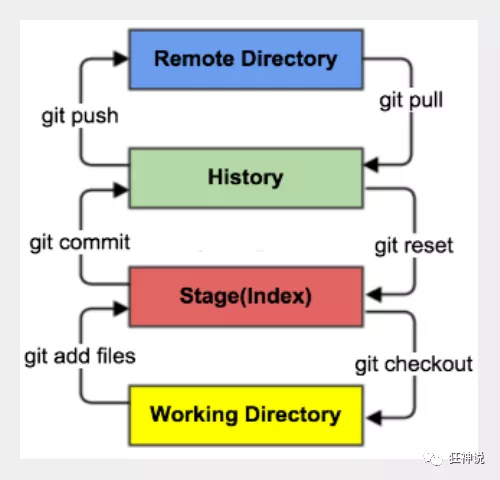
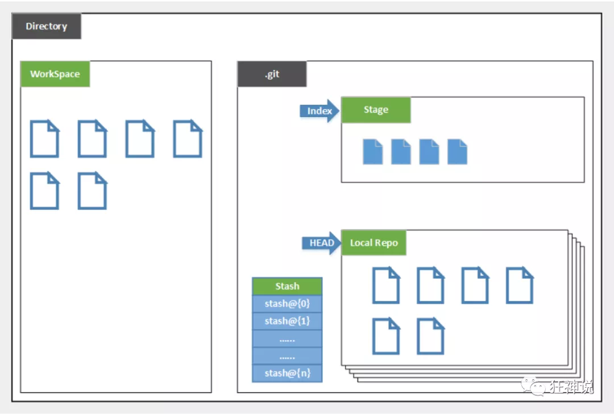
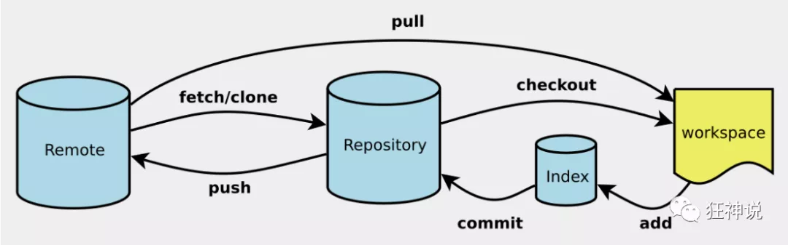
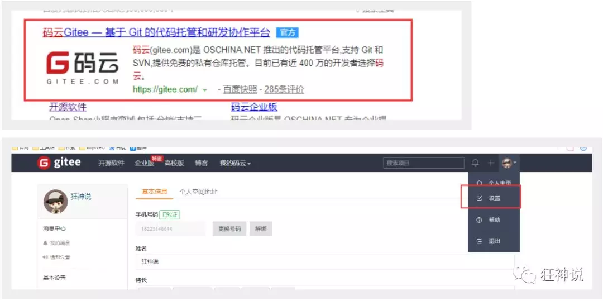
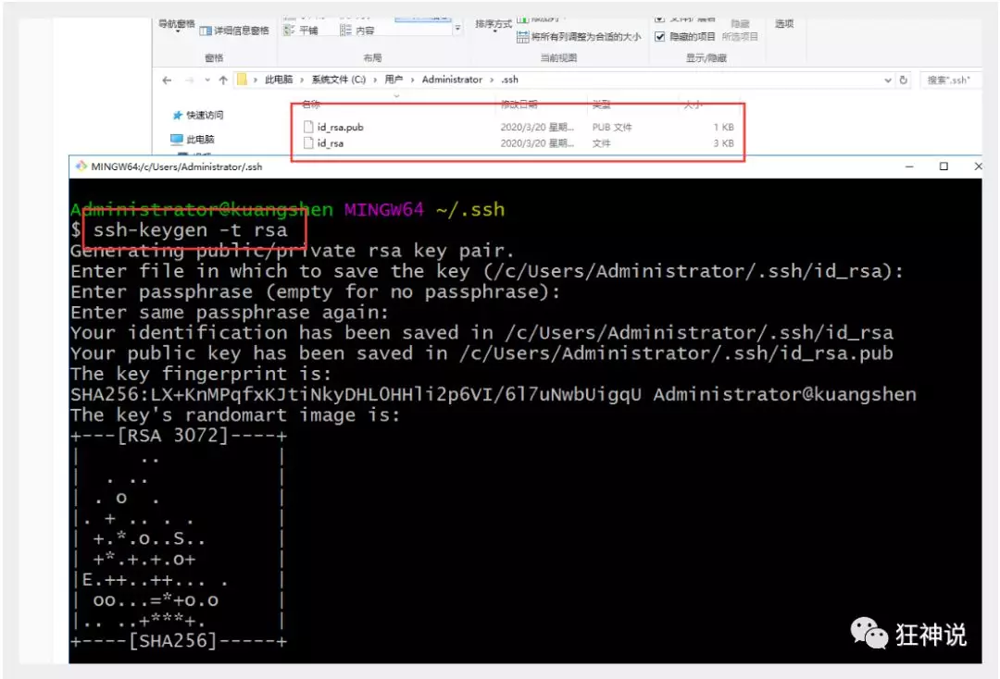
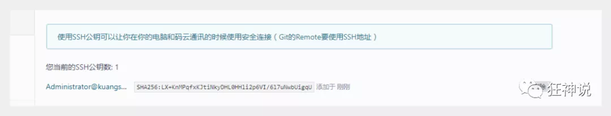

# 1.SVN与Git区别

## SVN 集中式版本控制系统

​		必须联网从中央服务器上拉取最新的代码，完成后还需要将代码提交

## Git 分布式版本控制系统

​		每个人本地都有一份，可通过push操作将代码推送至服务器,当然也可以没有中央服务器（则需要双方直接进行数据交换）


# 2.Git配置

## 配置基础知识

查看配置 （显示系统配置及用户配置）		git config -l

```
查看不同级别的配置文件：																//所有的配置文件，其实都保存在本地！
查看系统config				git config --system --list　　		//存储位置 C:\Program Files\Git\etc\gitconfig文件
查看当前用户（global）配置	git config --global --list		     //存储位置 C:\Users\Administrator\.gitconfig文件
```

## 用户配置

~~~bash
git config --global user.name "name"		//必须配置用户名和邮箱
git config --global user.email "email"
~~~

注：只需要做一次这个设置，如果你传递了--global 选项，因为Git将总是会使用该信息来处理你在系统中所做的一切操作。**如果你希望在一个特定的项目中使用不同的名称或e-mail地址，你可以在该项目中运行该命令而不要--global选项。**总之--global为全局配置，不加为某个项目的特定配置。


## 其他配置

### 配置忽略文件

在Git工作区的根目录下创建一个特殊的`.gitignore`文件，然后把要忽略的文件名填进去，Git就会自动忽略这些文件。

不需要从头写`.gitignore`文件，GitHub已经为我们准备了各种配置文件，只需要组合一下就可以使用了。所有配置文件可以直接在线浏览：https://github.com/github/gitignore

忽略文件的原则是：

1. 忽略操作系统自动生成的文件，比如缩略图等；
2. 忽略编译生成的中间文件、可执行文件等，也就是如果一个文件是通过另一个文件自动生成的，那自动生成的文件就没必要放进版本库，比如Java编译产生的`.class`文件；
3. 忽略你自己的带有敏感信息的配置文件，比如存放口令的配置文件。

### 配置是否显色

~~~bash
Git显示颜色
$ git config --global color.ui true
~~~

### 配置缩写

~~~bash
git config --global alias.缩写 全称 
~~~

~~~bash
推荐：log日志配置
git config --global alias.lg "log --color --graph --pretty=format:'%Cred%h%Creset -%C(yellow)%d%Creset %s %Cgreen(%cr) %C(bold blue)<%an>%Creset' --abbrev-commit"

~~~


# 3.Git基本理论

## 三个区域

Git本地有三个工作区域：

工作目录（Working Directory）、暂存区(Stage/Index)、资源库(Repository或Git Directory)。

如果在加上远程的git仓库(Remote Directory)就可以分为四个工作区域。文件在这四个区域之间的转换关系如下：



- Workspace：工作区，就是你平时存放项目代码的地方
- Stage/Index：暂存区，用于临时存放你的改动，**事实上它只是一个文件，保存即将提交到文件列表信息**
- Repository：仓库区（或本地仓库），就是安全存放数据的位置，这里面有你提交到所有版本的数据。**其中HEAD默认指向最新放入仓库的版本**
- Remote：远程仓库，托管代码的服务器，可以简单的认为是你项目组中的一台电脑用于远程数据交换


本地的三个区域确切的说应该是git仓库中HEAD指向的版本：




- Directory：使用Git管理的一个目录，也就是一个仓库，包含我们的工作空间和Git的管理空间。
- WorkSpace：需要通过Git进行版本控制的目录和文件，这些目录和文件组成了工作空间。
- .git：存放Git管理信息的目录，初始化仓库的时候自动创建。
- Index/Stage：暂存区，或者叫待提交更新区，在提交进入repo之前，我们可以把所有的更新放在暂存区。
- Local Repo：本地仓库，一个存放在本地的版本库；HEAD会只是当前的开发分支（branch）。
- Stash：隐藏，是一个工作状态保存栈，用于保存/恢复WorkSpace中的临时状态。


## .git 文件夹

***hooks（钩）****：存放一些**shell**脚本*

***Info****：**exclude（排除）**：存放仓库的一些信息*

***logs****：保存所有更新的引用记录*（目录下HEAD及下级的master）  

​			文件格式：上次提交哈希值	本次提交格式	用户名	邮箱	Linux时间	时区	提交信息

***objects****：存放所有的**git**对象*（即每个版本的内容）

***refs****：**heads**：保存**当前最新的一次提交的哈希值***

***COMMIT_EDITMSG***：*最新提交的一次**Commit Message**，**git**系统不会用到，给用户一个参考*

***config****：**git**仓库的配置文件*

***description****：仓库的描述信息，**主要给gitweb等git托管系统使用***

***HEAD****：映射到**ref**引用，能够找到下一次**commit**的前一次哈希值*（即**当前的哈希值**）

***index****：暂存区（**stage**），一个二进制文件*

***ORIG_HEAD***:HEAD指针的**前一个状态（哈希值）**


***FETCH_HEAD****： 是一个版本链接，指向着目前已经从远程仓库取下来的分支的末端版本*

***packed-refs****:* *当更新一个引用时，**git**不会**packed-refs**，而是会在**refs/heads**下写入一个新文件。当查找一个引用时，**git**首先在**refs**目录下查找，如果未找到则到**packed-refs**文件中去查找。*


## 工作流程

git的工作流程一般是这样的：

１、在工作目录中添加、修改文件；（工作区变更）

２、将需要进行版本管理的文件放入暂存区域；（变更提交至暂存区）

３、将暂存区域的文件提交到git仓库。（暂存区提交本地仓库）

因此，git管理的文件有三种状态：**已修改（modified）,已暂存（staged）,已提交(committed)**


# 4.Git项目搭建

## 创建工作目录与常用指令

工作目录（WorkSpace)一般就是你希望Git帮助你管理的文件夹，可以是你项目的目录，也可以是一个空目录，建议不要有中文。

日常使用只要记住下图6个命令：



## 本地仓库搭建

创建本地仓库的方法有两种：一种是创建全新的仓库，另一种是克隆远程仓库。

1、创建全新的仓库，需要用GIT管理的项目的根目录执行：

```
git init		# 在当前目录新建一个Git代码库 
```

2、执行后可以看到，仅仅在项目目录多出了一个.git目录，关于版本等的所有信息都在这个目录里面。

## 克隆远程仓库

另一种方式是克隆远程目录，由于是将远程服务器上的仓库完全镜像一份至本地！

```
git clone URL		# 克隆一个项目和它的整个代码历史(版本信息)
```


# 5.Git文件操作

## 文件的四种状态

版本控制就是对文件的版本控制，要对文件进行修改、提交等操作，首先要知道文件当前在什么状态，不然可能会提交了现在还不想提交的文件，或者要提交的文件没提交上。

- Untracked: 未跟踪, 此文件在文件夹中, 但并没有加入到git库, 不参与版本控制. 通过git add 状态变为Staged.
- Unmodify: 文件已经入库, 未修改, 即版本库中的文件快照内容与文件夹中完全一致. 这种类型的文件有两种去处, 如果它被修改, 而变为Modified. 如果使用git rm移出版本库, 则成为Untracked文件
- Modified: 文件已修改, 仅仅是修改, 并没有进行其他的操作. 这个文件也有两个去处, 通过git add可进入暂存staged状态, 使用git checkout 则丢弃修改过, 返回到unmodify状态, 这个git checkout即从库中取出文件, 覆盖当前修改 !
- Staged: 暂存状态. 执行git commit则将修改同步到库中, 这时库中的文件和本地文件又变为一致, 文件为Unmodify状态. 执行git reset HEAD filename取消暂存, 文件状态为Modified

## 查看文件状态

上面说文件有4种状态，通过如下命令可以查看到文件的状态：

```
#查看指定文件状态git status [filename]
#查看所有文件状态git status
# git add .                  添加所有文件到暂存区# git commit -m "消息内容"    提交暂存区中的内容到本地仓库 -m 提交信息
```

## 忽略文件

有些时候我们不想把某些文件纳入版本控制中，比如数据库文件，临时文件，设计文件等

在主目录下建立".gitignore"文件，此文件有如下规则：

1. 忽略文件中的空行或以井号（#）开始的行将会被忽略。
2. 可以使用Linux通配符。例如：**星号（*）代表任意多个字符，问号（？）代表一个字符，方括号（[abc]）代表可选字符范围，大括号（{string1,string2,...}）代表可选的字符串等**。
3. 如果名称的最前面有一个**感叹号（!），表示例外规则，将不被忽略**。
4. 如果名称的最前面是一个路径分隔符（/），表示要忽略的文件在此目录下，而子目录中的文件不忽略。
5. 如果名称的最后面是一个路径分隔符（/），表示要忽略的是此目录下该名称的子目录，而非文件（默认文件或目录都忽略）。

```
#为注释
*.txt        #忽略所有 .txt结尾的文件,这样的话上传就不会被选中！
!lib.txt     #但lib.txt除外
/temp        #仅忽略项目根目录下的TODO文件,不包括其它目录temp
build/       #忽略build/目录下的所有文件
doc/*.txt    #会忽略 doc/notes.txt 但不包括 doc/server/arch.txt
```


# 6.分支管理

## 分支操作

**查看分支**：`git branch`  `列出所有远程分支git branch -r`

**创建分支**：**`git branch <name>`**

**切换分支**：`git checkout <name>`或者**`git switch <name>`**

**合并某分支到当前分支**：`git merge <name>`		Fast-forward模式即“快进模式”，直接把master指向dev的当前提交，所以合并速度非常快

**删除分支**：`git branch -d <name>`		如果要丢弃一个没有被合并过的分支，可以通过`git branch -D <name>`强行删除。

**创建+切换分支**：`git checkout -b <name>`或者**`git switch -c <name>`**

**删除远程分支**：` git push origin --delete [branch-name]$ git branch -dr [remote/branch]`


## 分支合并冲突

**如果同一个文件在合并分支时都被修改了则会引起冲突：解决的办法是我们可以修改冲突文件后重新提交！选择要保留他的代码还是你的代码！**

进行合并时发生冲突，合并模式将会变为Auto-forward（不冲突情况下默认为Fast-forward），会保留两者冲突的内容

需要进行手动进行选择，修改好文件后需要进行add 和 commit操作将其同步到本地库


## 分支管理策略

通常，合并分支时，**如果可能，Git会用`Fast forward`模式，但这种模式下，删除分支后，会丢掉分支信息。**

如果要**强制禁用`Fast forward`模式，Git就会在merge时生成一个新的commit**，这样，从分支历史上就可以看出分支信息。

下面我们实战一下`--no-ff`方式的`git merge`：

```
首先，仍然创建并切换`dev`分支：
$ git switch -c dev

修改readme.txt文件，并提交一个新的commit：
$ git add readme.txt 
$ git commit -m "add merge"

$ git switch master

准备合并`dev`分支，请注意`--no-ff`参数，表示禁用`Fast forward`，因为本次合并要创建一个新的commit，所以加上`-m`参数，把commit描述写进去。
$ git merge --no-ff -m "merge with no-ff" dev	
```

合并分支时，加上`--no-ff`参数就可以用普通模式合并，合并后的历史有分支，能看出来曾经做过合并，而`fast forward`合并就看不出来曾经做过合并。


## 分支策略

`master`分支应该是非常稳定的，也就是仅用来发布新版本，平时不能在上面干活；

干活都在`dev`分支上，也就是说，`dev`分支是不稳定的，到某个时候，再把`dev`分支合并到`master`上

你和你的小伙伴们每个人都在`dev`分支上干活，每个人都有自己的分支，时不时地往`dev`分支上合并就可以了。


## bug分支

为神马需要对暂存区进行隐藏：开个新分支时，会将原本的status状态复制过来，为方便给修bug的分支一个干净的环境，不对其他不需要修改的部分造成破坏，需要相对当前状态进行隐藏，再在其上创建分支。

~~~bash
git stash 	//对现在的暂存区进行隐藏，以便进行bug修复

恢复（方法一）
git stash list 		//显示隐藏列表
git stash apply stash@{0}		//恢复指定的隐藏
git stash drop 		//使用该方法恢复后，隐藏并未隐藏列表消失，需要手动释放
恢复（方法二）推荐
git stash pop 		//恢复最近一次隐藏并在隐藏列表里删去记录
~~~


在master分支上修复了bug后，我们要想一想，dev分支是早期从master分支分出来的，所以，这个bug其实在当前dev分支上也存在。

同样的bug，要在dev上修复，我们只需要把`4c805e2 fix bug 101`这个提交所做的修改“复制”到dev分支。注意：**我们只想复制`4c805e2 fix bug 101`这个提交所做的修改，并不是把整个master分支merge过来。**

为了方便操作，Git专门提供了一个**`cherry-pick`**命令，让我们能复制一个特定的提交到当前分支：

```
$ git branch
* dev
  master
$ git cherry-pick 4c805e2
[master 1d4b803] fix bug 101
 1 file changed, 1 insertion(+), 1 deletion(-)
```

**Git自动给dev分支做了一次提交，注意这次提交的commit是`1d4b803`，它并不同于master的`4c805e2`，因为这两个commit只是改动相同，但确实是两个不同的commit。用`git cherry-pick`，我们就不需要在dev分支上手动再把修bug的过程重复一遍。**


## 多人协作注意点

多人协作的工作模式通常是这样：

1. 首先，可以试图用`git push origin <branch-name>`推送自己的修改；
2. 如果推送失败，则因为远程分支比你的本地更新，需要先用`git pull`试图合并；
3. 如果合并有冲突，则解决冲突，并在本地提交；
4. 没有冲突或者解决掉冲突后，再用`git push origin <branch-name>`推送就能成功！

- 在本地仓库和远程仓库关联之后，分支需要推送的话现需要先进行关联

~~~bash
如果git pull提示no tracking information，则说明本地分支和远程分支的链接关系没有创建，用命令
git branch --set-upstream-to <branch-name> origin/<branch-name>
~~~

小结：

- 查看远程库信息，使用`git remote -v`；
- 本地新建的分支如果不推送到远程，对其他人就是不可见的；
- 从本地推送分支，使用`git push origin branch-name`，如果推送失败，先用`git pull`抓取远程的新提交；
- 在本地创建和远程分支对应的分支，使用`git checkout -b branch-name origin/branch-name`，本地和远程分支的名称最好一致；
- 建立本地分支和远程分支的关联，使用`git branch --set-upstream branch-name origin/branch-name`；
- 从远程抓取分支，使用`git pull`，如果有冲突，要先处理冲突。


# 7.版本标签

## 标签创建

1. 切换到需要打标签的分支上
2. 敲命令`git tag <name>`就可以打一个新标签，默认标签是打在最新提交的commit上的

~~~bash
对指定版本打标签
比方说要对add merge这次提交打标签，它对应的commit id是f52c633，敲入命令：
$ git tag v0.9 f52c633

还可以创建带有说明的标签，用-a指定标签名，-m指定说明文字：
$ git tag -a v0.1 -m "version 0.1 released" 1094adb
~~~

查看标签：`git tag`标签不是按时间顺序列出，而是按字母排序的。

可以用`git show <tagname>`查看标签对应的详细信息


## 标签操作

**删除标签：**

```
$ git tag -d v0.1
```

因为创建的标签都只存储在本地，不会自动推送到远程。所以，打错的标签可以在本地安全删除。

**推送标签到远程：**

如果要推送某个标签到远程，使用命令`git push origin <tagname>`：

```
$ git push origin v1.0
```

或者，一次性推送全部尚未推送到远程的本地标签：

```
$ git push origin --tags
Total 0 (delta 0), reused 0 (delta 0)
To github.com:michaelliao/learngit.git
 * [new tag]         v0.9 -> v0.9
```

**删除远程标签：**

如果标签已经推送到远程，要删除远程标签就麻烦一点，先从本地删除：

```
$ git tag -d v0.9
```

然后，从远程删除。删除命令也是push，但是格式如下：

```
$ git push origin :refs/tags/v0.9
```

要看看是否真的从远程库删除了标签，可以登陆GitHub查看。


# 8.git常用命令

命令表：https://liaoxuefeng.gitee.io/resource.liaoxuefeng.com/git/git-cheat-sheet.html#

## 1. git log

`git log`命令显示从最近到最远的提交日志（以便确定要回退到哪个版本或查看记录）

如果嫌输出信息太多，看得眼花缭乱的，可以试试加上`--pretty=oneline`参数

~~~bash
git log --pretty=oneline
~~~

~~~bash
选项 说明
-p 按补丁格式显示每个更新之间的差异。
--stat 显示每次更新的文件修改统计信息。
--shortstat 只显示 --stat 中最后的行数修改添加移除统计。
--name-only 仅在提交信息后显示已修改的文件清单。
--name-status 显示新增、修改、删除的文件清单。
--abbrev-commit 仅显示 SHA-1 的前几个字符，而非所有的 40 个字符。
--relative-date 使用较短的相对时间显示（比如，“2 weeks ago”）。
--graph 显示 ASCII 图形表示的分支合并历史。
--pretty 使用其他格式显示历史提交信息。可用的选项包括 oneline，short，full，fuller 和 format（后跟指定格式）。
~~~


## 2. git reset

~~~bash
对本地库操作（回退版本）：
回退到上个版本
git reset --hard HEAD^
回退到指定版本
git reset --hard hash值

对暂存区操作：
git reset HEAD filename		可以把暂存区的文件撤销掉（unstage）（不会覆盖工作区的内容）
~~~


## 3. git reflog

用来显示版本信息引用变化（能够显示回退后之前的版本）


## 4. git checkout

**以最新状态（本地库或暂存区）还原工作区**

`git checkout`其实是用版本库里的版本替换工作区的版本，无论工作区是修改还是删除，都可以“一键还原”。

命令`git checkout -me.txt`意思就是，把`readme.txt`文件在工作区的修改全部撤销，这里有两种情况：

一种是`readme.txt`自修改后还没有被放到暂存区，现在，撤销修改就回到和版本库一模一样的状态；

一种是`readme.txt`已经添加到暂存区后，又作了修改，现在，撤销修改就回到添加到暂存区后的状态。


~~~bash
git checkout -- file	丢弃工作区的修改
~~~

**`git checkout -- file`命令中的`--`很重要，没有`--`，就变成了“切换到另一个分支”的命令，我们在后面的分支管理中会再次遇到`git checkout`命令。**


## 5. git rm

~~~bash
删除本地库的文件
git rm filename
git commit -m "删除了file"
~~~

若工作区删错了文件

可通过checkout来恢复工作区


## 6. git push

由于远程库是空的，我们第一次推送`master`分支时，加上了`-u`参数，**Git不但会把本地的`master`分支内容推送的远程新的`master`分支，还会把本地的`master`分支和远程的`master`分支关联起来，**在以后的推送或者拉取时就可以简化命令。

~~~bash
$ git push -u origin master
~~~

执行完 -u 之后，只要本地作了提交，就可以通过命令：

```
$ git push origin master
```


## 7. git remote

在关联好SSH之后

通过其将本地库与远程库相关联

```bash
$ git remote add origin（代表远程仓库） git地址
```


# 9.远程库使用

github 是有墙的，比较慢，在国内的话，我们一般使用 gitee ，公司中有时候会搭建自己的gitlab服务器

1、注册登录码云，完善个人信息




2、设置本机绑定SSH公钥，实现免密码登录！（免密码登录，这一步挺重要的，码云是远程仓库，我们是平时工作在本地仓库！)

```
# 进入 C:\Users\Administrator\.ssh 目录# 生成公钥ssh-keygen
```



3、将公钥信息public key 添加到码云账户中即可！



4、使用码云创建一个自己的仓库！

- 许可证：开源是否可以随意转载，开源但是不能商业使用，不能转载，...  限制！

克隆到本地！


## SSH警告

当你第一次使用Git的`clone`或者`push`命令连接GitHub时，会得到一个警告：

```
The authenticity of host 'github.com (xx.xx.xx.xx)' can't be established.
RSA key fingerprint is xx.xx.xx.xx.xx.
Are you sure you want to continue connecting (yes/no)?
```

这是因为Git使用SSH连接，而SSH连接在第一次验证GitHub服务器的Key时，需要你确认GitHub的Key的指纹信息是否真的来自GitHub的服务器，输入`yes`回车即可。

Git会输出一个警告，告诉你已经把GitHub的Key添加到本机的一个信任列表里了：

```
Warning: Permanently added 'github.com' (RSA) to the list of known hosts.
```

这个警告只会出现一次，后面的操作就不会有任何警告了。

如果你实在担心有人冒充GitHub服务器，输入`yes`前可以对照[GitHub的RSA Key的指纹信息](https://help.github.com/articles/what-are-github-s-ssh-key-fingerprints/)是否与SSH连接给出的一致。


## 删除远程库

如果添加的时候地址写错了，或者就是想删除远程库，可以用`git remote rm <name>`命令。使用前，建议先用`git remote -v`查看远程库信息：

```
$ git remote -v
origin  git@github.com:michaelliao/learn-git.git (fetch)
origin  git@github.com:michaelliao/learn-git.git (push)
```

然后，根据名字删除，比如删除`origin`：

```
$ git remote rm origin
```

此处的“删除”其实是解除了本地和远程的绑定关系，并不是物理上删除了远程库。远程库本身并没有任何改动。要真正删除远程库，需要登录到GitHub，在后台页面找到删除按钮再删除。


# 10.开源许可证

[GitHub License 开源许可证选择指南_金_猪耶的博客-CSDN博客](https://blog.csdn.net/qq_30621591/article/details/115353517?utm_medium=distribute.pc_relevant.none-task-blog-baidujs_title-0&spm=1001.2101.3001.4242)


# 11.github加速

1. 通过修改 HOSTS 文件进行加速

------

手动把cdn和ip地址绑定。

- 第一步：获取 github 的 global.ssl.fastly 地址 访问：[http://github.global.ssl.fast...](https://link.zhihu.com/?target=http%3A//github.global.ssl.fastly.net.ipaddress.com/%23ipinfo) 获取cdn和ip域名：


得到：199.232.69.194 [https://github.global.ssl.fas...](https://link.zhihu.com/?target=https%3A//github.global.ssl.fastly.net/)

- 第二步：获取[http://github.com](https://link.zhihu.com/?target=http%3A//github.com)地址

访问：[https://github.com.ipaddress....](https://link.zhihu.com/?target=https%3A//github.com.ipaddress.com/%23ipinfo) 获取cdn和ip：


得到：140.82.114.4 [http://github.com](https://link.zhihu.com/?target=http%3A//github.com/)

- 第三步：修改 host 文件映射上面查找到的 IP

windows系统：

1、修改C:WindowsSystem32driversetchosts文件的权限，指定可写入：右击->hosts->属性->安全->编辑->点击Users->在Users的权限“写入”后面打勾。如下：


然后点击确定。

2、右击->hosts->打开方式->选定记本（或者你喜欢的编辑器）->在末尾处添加以下内容：

```text
199.232.69.194 github.global.ssl.fastly.net
140.82.114.4 github.com
```


# 12.如何寻找开源项目

```
# 按照项目名/仓库名搜索（大小写不敏感）
in:name xxx
# 按照README搜索（大小写不敏感）
in:readme xxx
# 按照description搜索（大小写不敏感）
in:description xxx
# stars数大于xxx
stars:>xxx
# forks数大于xxx
forks:>xxx
# 编程语言为xxx
language:xxx
# 最新更新时间晚于YYYY-MM-DD
pushed:>YYYY-MM-DD
```
