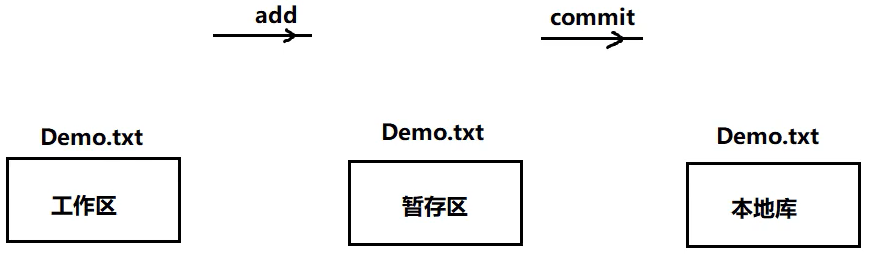
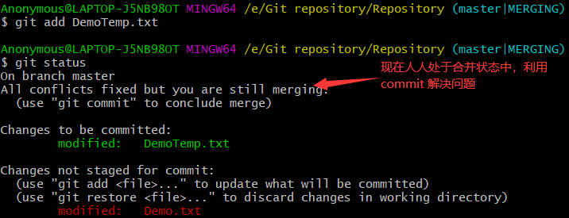
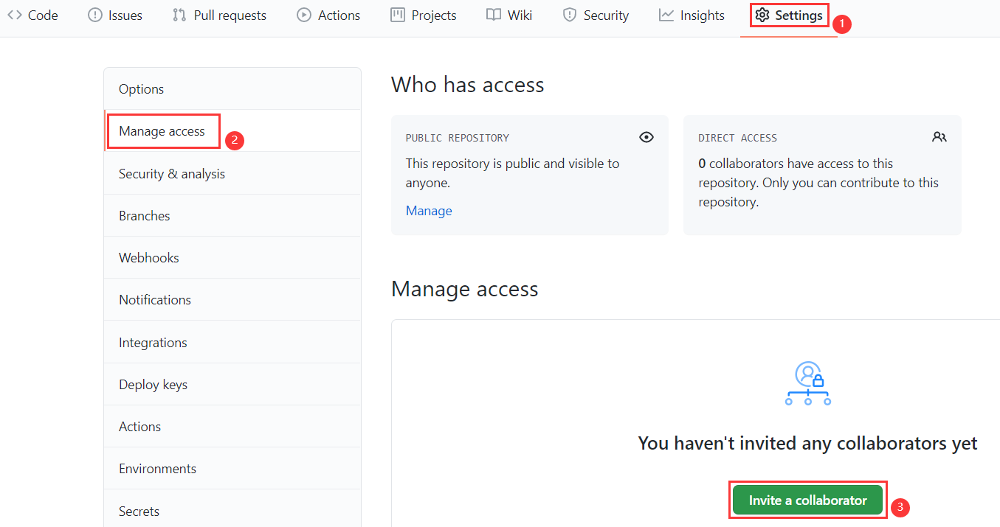
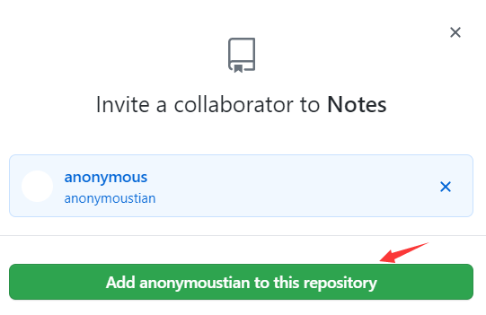

[官方文档](https://guides.github.com/activities/hello-world/)

[toc]

## Git

### Git 概念

Git 是一个免费的、开源的<u>**分布式版本控制系统**</u>，可以快速高效地处理从小型到大型的项目。

### 版本控制系统

**什么是版本控制？**

版本控制是一种记录一个或若干文件内容变化，以便将来查阅特定版本修订情况的系统。
**为什么要使用版本控制？**
软件开发中采用版本控制系统是个明智的选择。
有了它你就可以将某个文件回溯到之前的状态，甚至将整个项目都回退到过去某个时间点的状态。
就算你乱来一气把整个项目中的文件改的改删的删，你也照样可以轻松恢复到原先的样子。
但额外增加的工作量却微乎其微。你可以比较文件的变化细节，查出最后是谁修改了哪个地方,从而找出导致怪异问题出现的原因，又是谁在何时报告了某个功能缺陷等等。
**版本控制系统的分类**:

* **集中化的版本控制系统：**

  

  集中化的版本控制系统诸如CVS、SVN以及Perforce等，都有一个单一的集中管理的服务器,保存所有文件的修订版本，而协同工作的人们都通过客户端连到这台服务器取出最新的文件或者提交更新。多年以来，这已成为版本控制系统的标准做法，这种做法带来了许多好处现在每个人都可以在一定程度上看到项目中的其他人正在做些什么。而管理员也可以轻松掌控每个开发者的权限，并且管理一个集中化的版本控制系统;要远比在各个客户端上维护本地数据库来得轻松容易。
  事分两面，有好有坏。这么做最显而易见的缺点是中央服务器的*单点故障*。如果服务器宕机一小时，那么在这一小时内， 谁都无法提交更新， 也就无法协同工作。

* **分布式的版本控制系统：**

  由于上面集中化版本控制系统的那些缺点，于是分布式版本控制系统面世了。
  在这类系统中，像 Git、 BitKeeper 等，客户端并不只提取最新版本的文件快照，而是把代码仓库完整地镜像下来。

  

  更进一步，许多这类系统都可以指定和若干不同的远端代码仓库进行交互。这样，你就可以在同一个项目中分别和不同工作小组的人相互协作。

  分布式的版本控制系统在管理项目时存放的不是项目版本与版本之间的差异。它存的是索引(所需磁盘空间很少所以每个客户端都可以放下整个项目的历史记录)

  

### Git 的本地结构


### 代码托管中心

**代码托管中心作用是什么?**
我们已经有了本地库，本地库可以帮我们进行版本控制，为什么还需要代码托管中心呢?
它的任务是帮我们维护远程库,
下面说一下本地库和远程库的交互方式， 也分为两种: 

1. 团队内部协作

   

2. 跨团队协作

   

**托管中心种类:**
局域网环境下：可以搭建 GitLab 服务器作为代码托管中心，GitLab 可以自己去搭建
外网环境下：可以由 GitHub 或者 Gitee 作为代码托管中心，GitHub 或者 Gitee 是现成的托管中心，不用自己去搭建

### 初始化本地仓库及Git常用命令

1. 创建一个文件夹

   

2. 打开 Git 终端

   Git Bush Here：

   进入以后先对字体和编码进行设置：

   


**在 Git 中命令跟 Linux 是一样的：**

1. 查看 Git 安装版本：

   `$ git --version`

   

2. 清屏：

   `$ clear`

   

3. 设置签名：

   设置用户名和邮箱：

   `$ git config --global user.name "用户名"`

   `$ git config --global user.email "邮箱"`

   

4. 本地仓库的初始化：

   `$ git init`

   

   > .git 目录是隐藏的：可以调出来查看 

5. 查看 .git 下的内容：

   查看当前目录下的文件：`$ ll`

   查看当前目录下的子目录：`$ ll -la`

   回退到本目录上一级：`cd ..`

   打开子目录：`cd 子目录名`

   

   

   > .git 目录下的本地库相关的子目录和子文件不要删除，不要胡乱修改。

6. 添加文件： add      提交文件：commit

   1. 先创建一个文件：

      

   2. 将文件提交到暂存区：

      `$ git add 文件名`

      `$ git add Demo.txt`

      

   3. 将暂存区的内容提交到本地库

      `$ git commit -m "提交时的文字说明" 文件名`

      `$ git commit -m "This is the first submission" Demo.txt`

      

   > 
   >
   > 1. 不放在本地仓库中的文件，git 是不进行管理的
   > 2. 即使放在本地仓库的文件，git 也不管理，必须通过 add、cimmit 命令操作才可以将内容提交到本地库

7. 查看工作区和暂存区的状态

   `$ git status`
   
   创建一个文件，然后查看状态：
   
   
   
   
   
   然后将新创建的文件通过 `git add` 命令提交至暂存区：
   
   
   
   查看状态：
   
   
   
   使用 `git commit` 命令将文件提交至文本库：
   
   
   
   修改新创建文件中的文本内容：
   
   
   
   然后查看状态：
   
   
   
   重新添加至暂存区，然后将暂存区的文件提交至本地库：
   
   
   
   提交完再查看状态：
   
   
   
8. 查看提交（显示从最近时间提交到最远时间提交）：

   `$ git log`

   

   > 当前历史记录对应的索引是通过哈希算法得到的。

   当历史记录过多的时候，查看日志的时候有分页效果（一页展示不下）：

   相应操作：

   下一页：`空格`

   上一页：`b`

   到尾页后会显示 `(END)`

   退出： `q`

   

   

   日志展示方式：

   * 方式1：`$ git log`

   * 方式2：`$ git log --pretty=oneline`

     

   * 方式3：`$ git log --oneline`

     

   * 方式4：`git reflog`

     增加了信息：`HEAD@{数字}`

     >  数字的含义：指针回到当前这个历史版本需要走多少步

     

9. 前进或后退到历史：

   * reset命令：前进或者后退历史版本

     `$ git reset --hard 版本索引`

     

     1. hard参数

        `$ git reset --hard [索引]`

        本地库的指针移动的同时，重置暂存区和工作区

        

     2. mixed参数

        `$ git reset --mixed [索引]`

        本地库的指针移动的同时，重置暂存区，但是工作区不动

        

     3. soft参数

        `$ git reset --soft [索引]`

        本地库的指针移动的时候，暂存区、工作区都不动

        

     > 总结：以后用的多的是第一种 `hard` 参数

   > 复制：鼠标在终端拖动选中完成复制
   >
   > 粘贴：右键 -> Paste

10. 删除/找回文件：

    `$ rm 文件名`

    `$ rm DemoTemp.txt`

    

    将删除操作同步到暂存区和本地库：

    

    查看日志：

    

    找回本地库中删除的文件（实际上就是将历史版本切换到删除文件前的那个版本）

    

    

    找回暂存区删除的文件：

    删除工作区数据并同步到暂存区：

    

    恢复暂存区中的数据：

    

11. 查看工作区与暂存区、暂存区与本地仓库的差异：

    `$ git diff 文件名`：将工作区中的文件和暂存区中的文件进行对比

    更改工作区中 DemoTemp.txt 中的内容：

    

    导致工作区和暂存区不一致，对比：

    

    `$ git diff`：比较工作区中和暂存区中所有文件的差异

    

    `$ git diff 历史版本 文件名`：比较暂存区和工作区中的内容

    

    

### 分支

什么是分支？

在版本控制过程中，使用多条线同时推进多个任务。这里面说的多条线就是多个分支。

图示：


分支的好处：同时多个分支可以并行开发，互相不耽误，互相不影响，提高开发效率。如果有有一个分支功能开发失败，直接删除这个分支就可以，不会对其他分支产生任何影响。

**操作分支**

1. 查看分支：

   `$ git branch -v`

   

2. 创建分支：

   `$ git branch 分支名称`

   

3. 切换分支：

   `$ git checkout 分支名称`

   

解决冲突问题

1. 进入`branchSecondary` 分支，增加内容

   

   

2. 将分支切换为 `master`

   

   

3. 然后在主分支下添加内容

   

   

4. 再次切换到 `branchSecondary` 分支查看

   `cat 文件名`：查看文本文件中的内容

   

5. 将` branchSecondary` 分支 合并到 主分支`master`

   1. 进入主分支，并将 `branchSecondary`中的内容和主分支内容合并

      `$ git merge 分支名称`

      

      查看文件：
      
      

**什么时候会出现冲突问题？**

​		**在同一个文件的同一个位置修改**

**解决：**公司内部商议解决，或者自己决定，留下想要的即可。


1. 将工作区的内容添加到暂存区并查看当前状态

   

2. 进行 commit 操作

   

## GitHub

### 创建GitHub远程仓库


### 在本地仓库创建远程仓库别名

远程仓库的地址：


远程仓库地址比较长，每次复制比较麻烦

https://github.com/GitHub-anonymousV/Notes.git

在 Git 本地将地址保存，通过别名访问

`$ git remote -v`：查看别名

`$ git remote add 别名 远程仓库地址`：为远程创库起别名


### 推送操作

`$ git push 远程仓库名/远程仓库别名 要推送的分支名`


推送成功后，查看远程仓库：


### 克隆操作

1. 远程地址复制

   

2. 克隆操作

   `$ git clone 远程仓库地址`
   
   

克隆操作可以帮我们完成：

1. 初始化本地库

2. 将远程库内容完整的克隆到本地库

3. 替我们创建远程仓库别名

   

### 邀请加入团队push操作

`$ git push 远程仓库别名 推送分支的名称`

1. 更新工作区的内容，然后添加到暂存区，又提交到本地库

   

2. push内容到远程库中

   发现可以直接 `push` 进去，并没有让我录入账号密码或者没有提示错误

   原因：`git` 使用的时候在本地有缓存

   

   删除缓存：

   

   

3. 再次重新 `push` ，发现出错了

   ``` 
   remote: Permission to GitHub-anonymousV/Notes.git denied to GitHub-anonymousV/Notes.git
   fatal: unable to access 'https://github.com/GitHub-anonymousV/Notes.git'
   requested URL returned error: 403
   ```

4. 必须要加入团队：登录项目经理的账号，邀请普通成员

   

   

   

   

5. 登录被邀请者的账号，接收邀请：

   

6. 再次提交即可提交成功

### 远程仓库修改的拉取

`$ git pull 远程仓库名/远程仓库别名  要拉取的分支名`

1. 拉取操作 `pull` 操作，相当于 `fetch + merge`

   

2. 项目经理先确认远程库内容是否更新了

   

3. 项目经理进行拉取

   1. 先是抓取操作：`fetch`

      

   2. 在抓取操作执行后，只是将远程库的内容下载到本地，但是工作区中的文件并没有更新。工作区中还是原先的内容

      

   3. 抓取后可以去远程库中查看内容是否正确

      

   4. 检查内容正确，进行合并操作（合并前应该讲分支切换回来）

      `$ git checkout 分支名称`：切换分支

      `$ git merge 远程仓库名/分支名`

      

远程仓库的拉取可以直接用 `pull` 命令来完成：


> `fetch+merge`操作 -> 检查正确性，保险
>
> `pull` -> 代码简单

### 协同开发合作时冲突的解决办法

* 产生冲突

  1. 第一个程序员修改工作区内容后向远程仓库推送数据

     

     

  2. 第二个程序员修改了工作区的相同内容后向远程仓库推送数据

     

     

     **产生了冲突，推送失败**

* 解决冲突

  在冲突情况下，先应该拉取下来修改冲突，然后再推送到远程服务器

  1. 拉取并查看冲突

     

  2. 个人解决冲突（该删的删、该留的留）

     

  3. 解决完冲突后，向服务器推送

     

     

  4. 冲突解决

     

### 跨团队合作


1. 得到远程仓库的地址

   

2. 进行 `fork` 操作

   进入GitHub账号后，在浏览器地址栏复制地址：https://github.com/TheAlgorithms/Java.git

   

   

3. 然后就可以克隆到本地，并且进行修改

   `$ git clone 远程仓库地址`：将远程仓库克隆到本地

   

4. 然后更改数据、添加到暂存区、提交到本地仓库、`push` 到远程仓库

5. 进行 `pull request` 操作

   

   

   

6. 进行审核操作

   

   查看具体提交内容

   

   确定通过以后，进行合并

   

### SSH免密码登录

1. 进入用户的主目录

   `cd ~`：进入用户主目录

   

2. 执行命令，生成一个 `.ssh` 的目录

   `$ ssh-keygen -t rsa -C  GitHub账号对应的邮箱`

   

   > keygen --> key generation
   >
   > C 要大写
   >
   > 后面的邮箱是GitHub注册账号的时候对应的邮箱
   >
   > 输入后	按三次回车使用默认值即可

   发现在 .ssh 目录下有两个文件

   

3. 打开 id.rsa.pub 文件，将里面的内容进行复制操作

   ``` 
   ssh-rsa AAAAB3NzaC1yc2EAAAADAQABAAABgQCpMT1aLddJRIlNXjKEFJUwtregk2hsAxIjXUoOkf2PcdzLkaZooHftMVIUNZtS+LsyWwnm7uLRGlkN+XiOndUW5QikTsN+3JMWnn1+DPzQ310/yxMoBSy0f5APBdMB3dzw1M/asXI/XUs3hzdhkZCWRZzsaIFbdLtHI88N+QPS+oAW433LUjz6d8iGXFa8QcM0QIptQVPjN7cEaoFEaMojy6+ggcj/Gpt6cIO5/WFHei2u7f3aROq5hOxJ4QF4fRg8w/g52nRoq3YZPDu9OCJEUo6Lh4AfR8RW1uAemdXL+pyxWVUq+38RN6q1F2cvIB3w1bXucTzM+jr0G6cIfJKkgKx1YczmCYeLR7MpeEzLFmRzW5BBOG6A0C4Y4iicBCpbhm41MQLovmldPEV8Y63YE9zCAC/g3UdikG5imA+J5pixziBF3DPwSjYtd+BQ5VUmA7kKXlXAUWLy7d+9tANr0d+CM+otKlT1m57qUAIdvisxCDquBL7tzr4MfgAHMEk= GitHub注册账号的时候对应的邮箱
   ```

4. 打开GitHub账号，生成密钥

   

   

   

   

5. 生成密钥以后，就可以正常进行 `push` 操作了

   1. 对 `ssh`远程地址起别名并查看别名

      

   2. 创建一个文件，添加到暂存区，提交到本地仓库，然后push到远程仓库（地址用 `ssh` 方式地址）

      

> SSH方式好处：不需要每次都进行身份验证
>
> 缺陷：只能针对一个账号

### IDEA集成Git/初始化本地仓库/添加到暂存区/提交到本地库

* IDEA集成Git


* 本地库的初始化操作


本地库初始化完成，生成了 .git 目录


>  进行 `add` 操作即将文件添加到暂存区

* 再模块`Module`进行`add`操作将其添加到暂存区


* 模块`Module`进行`commit`操作，将暂存区中的模块内容添加到本地仓库


在类中修改内容后再次提交

修改内容后，和本地库内容不一样的位置前面会显示绿色：

可以再次进行 `add` 和 `commit` 操作将工作区中修改后的内容同步到本地仓库：


### 使用IDEA拉取和推送资源

因为它们是两个不同的项目，要把两个不同的项目合并，`git`需要添加一句代码，在 `git pull` 之后。这句代码是在 `git 2.9.2` 版本发生的，最新的版本需要添加 `--allow-unrelated-histories` 告诉 `git` <u>允许不相关的历史合并</u>。

假如我们的源是 `origin`，分支是 `master`，那么我们需要这样写 `$ git pull origin master --allow-unrelated-histories`这个方法只解决因为两个仓库有不同的开始点，也就是两个仓库没有共同的 `commit` 出现的无法提交。如果使用文本的方法还无法提交，需要看一下是不是发生了冲突，解决冲突再提交。

`push`推送：`$ git push -u origin master -f`

`$ git pull 远程仓库地址/远程仓库别名 拉取的分支 --allow-unrelated-histories`

`$ git push -u 远程仓库地址/远程仓库别名 推送到的分支  -f`

记录信息/添加备注（添加完 按`Esc` -> 按 `:` -> 输入 `wq`）：


经过 `pull` 和 `push` 操作后，远程仓库和本地仓库就可以进行交互了。

* 在IDEA中进行推送

  

  

  

  

  创建另一个类并对其进行`add`操作添加到暂存区、`commit`操作从暂存区提交到本地仓库、`push`操作推送到远程仓库

  

  

  

  

  

  **一般在开发中先进行 `pull` 操作，再进行 `push` 操作，不会直接进行 `push` 操作，这是为了防止因冲突出现而导致推送失败。**

  

  

  

### 使用IDEA克隆远程仓库到本地


**克隆到本地后，这个目录即变成了一个本地仓库，又变成了工作空间。**


### 使用IDEA解决冲突及如何避免冲突

在 `push` 后，有冲突时会提示合并操作：


解决冲突并成功推送到远程仓库

如何避免冲突？

* 在团队开发的时候避免在一个文件中改代码
* 在修改一个文件后，在 `push` 操作推送前，先进行 `pull` 操作拉取，使内容同步进而避免冲突