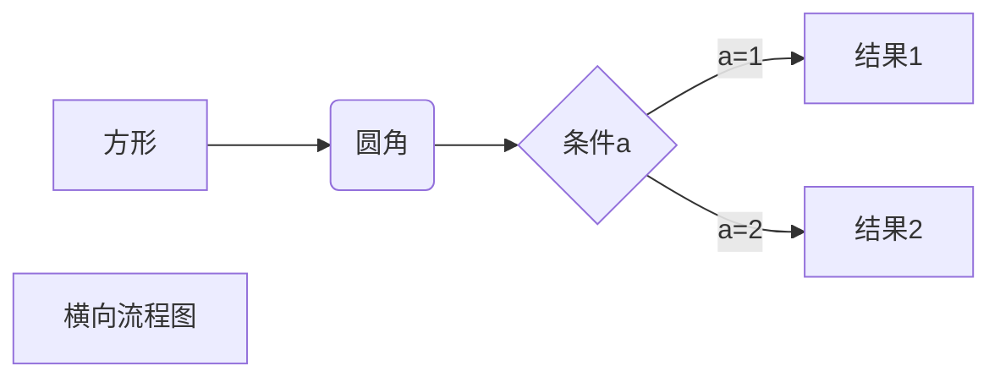
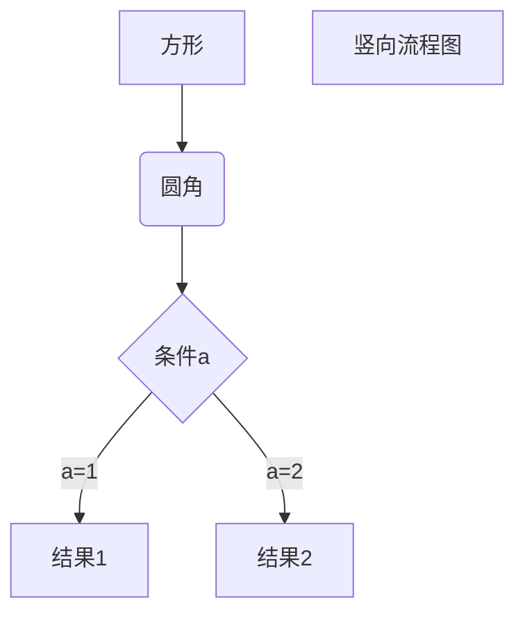
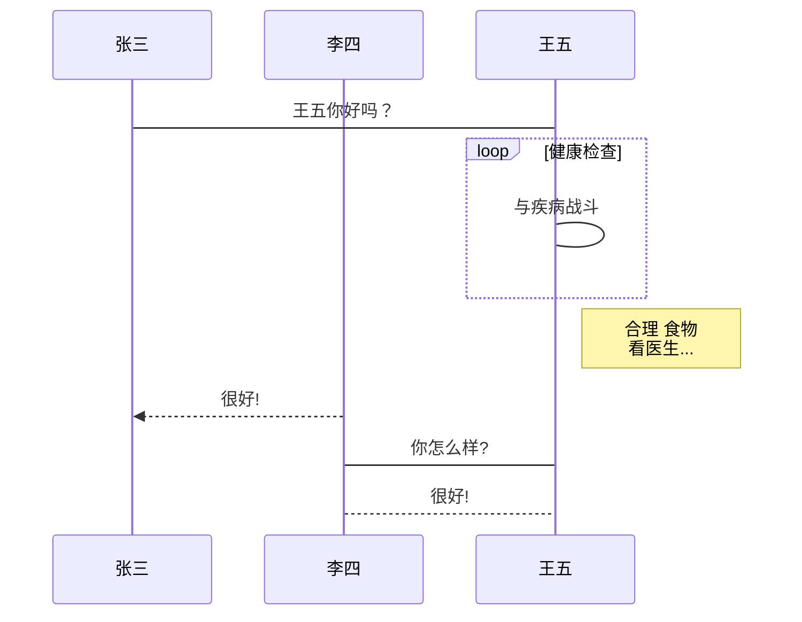
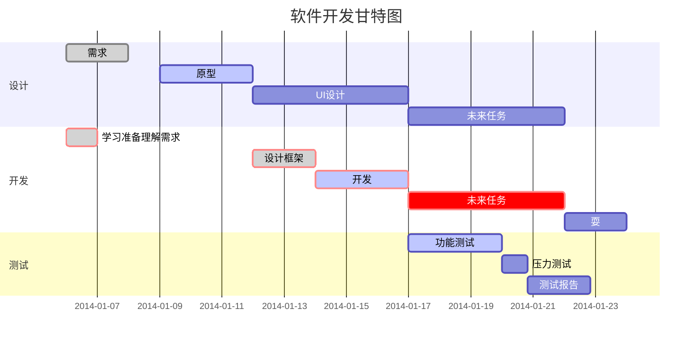

# MarkDown语法规则

## 1. 标题

使用 **#** 号可表示 1-6 级标题，一级标题对应一个 **#** 号，二级标题对应两个 **#** 号，以此类推。

```
# 一级标题
## 二级标题
### 三级标题
#### 四级标题
##### 五级标题
###### 六级标题
```


## 2. 段落格式

## 2.1 段落

**段落的换行是使用两个以上空格加上回车**。

当然也可以在段落后面使用一个空行来表示重新开始一个段落。


### 2.2 字体

Markdown 可以使用以下几种字体：

```
*斜体文本*		//推荐
_斜体文本_
**粗体文本**
__粗体文本__
***粗斜体文本***
___粗斜体文本___
```


### 2.3 分隔线

你可以在一行中用三个以上的星号、减号、底线来建立一个分隔线，行内不能有其他东西。你也可以在星号或是减号中间插入空格。下面每种写法都可以建立分隔线：

```
***				

* * *

*****

- - -		 //推荐

----------
```


### 2.4 删除线

如果段落上的文字要添加删除线，只需要在文字的两端加上两个波浪线 **~~** 即可

```
~~BAIDU.COM~~
```

~~BAIDU.COM~~


### 2.5 下划线

下划线可以通过 HTML 的 **<u>** 标签来实现：

```
<u>带下划线文本</u>
```


### 2.6 脚注

脚注是对文本的补充说明。

Markdown 脚注的格式如下:

```
[^要注明的文本]
```

以下实例演示了脚注的用法：

```
创建脚注格式类似这样 [^RUNOOB]。
[^RUNOOB]: 菜鸟教程 -- 学的不仅是技术，更是梦想！！！
```

创建脚注格式类似这样 [^RUNOOB]。

[^RUNOOB]: 菜鸟教程 -- 学的不仅是技术，更是梦想！！！


## 3. 列表

### 3.1 无序列表

无序列表使用星号(*****)、加号(**+**)或是减号(**-**)作为列表标记，这些标记后面要添加一个空格，然后再填写内容：

```
* 第一项		
* 第二项
* 第三项

+ 第一项
+ 第二项
+ 第三项


- 第一项			//推荐
- 第二项
- 第三项
```


### 3.2 有序列表

有序列表使用数字并加上 **.** 号来表示，如：

```
1. 第一项
2. 第二项
3. 第三项
```


### 3.3 列表嵌套

列表嵌套只需在子列表中的选项前面添加四个空格即可：

```
1. 第一项：
    - 第一项嵌套的第一个元素
    - 第一项嵌套的第二个元素
2. 第二项：
    - 第二项嵌套的第一个元素
    - 第二项嵌套的第二个元素
```

1. 第一项：

    - 第一项嵌套的第一个元素
    - 第一项嵌套的第二个元素

2. 第二项：
    - 第二项嵌套的第一个元素
    - 第二项嵌套的第二个元素


## 4. 区块

Markdown 区块引用是在段落开头使用 **>** 符号 ，然后后面紧跟一个**空格**符号：

```
> 区块引用
```

> 区块引用

另外区块是可以嵌套的，一个 **>** 符号是最外层，两个 **>** 符号是第一层嵌套，以此类推：

```
> 最外层
> > 第一层嵌套
> > > 第二层嵌套
```

> 最外层
> > 第一层嵌套
> >
> > > 第二层嵌套


区块可和列表配合使用

```
* 第一项
    > 菜鸟教程
    > 学的不仅是技术更是梦想
* 第二项
```


## 5. 代码

### 5.1 代码段

如果是段落上的一个函数或片段的代码可以用反引号把它包起来（**`**），例如：

```
`printf()` 函数
```


### 5.2 代码块

代码区块使用 **4 个空格**或者一个**制表符（Tab 键）**。-----用来展示一行不指定语言类型的代码

**用 ``` 包裹一段代码，并指定一种语言（也可以不指定）**


## 6. 链接

### 常用链接方式

链接使用方法如下：

```
[链接名称](链接地址)

或者

<链接地址>
```

例如：

```
这是一个链接 [菜鸟教程](https://www.baidu.com)
```

这是一个链接 [菜鸟教程](https://www.runoob.com)

```
<https://www.baidu.com>
```

<https://www.baidu.com>


### 高级链接方式

我们可以通过变量来设置一个链接，变量赋值在文档末尾进行：

```
这个链接用 1 作为网址变量 [Google][1]
然后在文档的结尾为变量赋值（网址）

  [1]: http://www.google.com/
```

这个链接用 1 作为网址变量 [Google][1]
然后在文档的结尾为变量赋值（网址）

[1]: http://www.google.com/


## 7. 图片

Markdown 图片语法格式如下：

```


```

- 开头一个感叹号 !
- 接着一个方括号，里面放上图片的替代文字
- 接着一个普通括号，里面放上图片的网址，最后还可以用引号包住并加上选择性的 'title' 属性的文字。

注：没有办法指定图片的高度与宽度


## 8. 表格

Markdown 制作表格使用 **|** 来分隔不同的单元格，使用 **-** 来分隔表头和其他行。

语法格式如下：

```
|  表头   | 表头  |
|  ----  | ----  |
| 单元格  | 单元格 |
| 单元格  | 单元格 |
```

| 表头   | 表头   |
| ------ | ------ |
| 单元格 | 单元格 |
| 单元格 | 单元格 |


对齐方式

**我们可以设置表格的对齐方式：**

- **-:** 设置内容和标题栏居右对齐。
- **:-** 设置内容和标题栏居左对齐。
- **:-:** 设置内容和标题栏居中对齐。

实例如下：

```
| 左对齐 | 右对齐 | 居中对齐 |
| :-----| ----: | :----: |
| 单元格 | 单元格 | 单元格 |
| 单元格 | 单元格 | 单元格 |
```


## 9.技巧

### 9.1 转义

Markdown 使用了很多特殊符号来表示特定的意义，如果需要显示特定的符号则需要使用转义字符，Markdown 使用反斜杠转义特殊字符：

```
**文本加粗** 
\*\* 正常显示星号 \*\*
```


### 9.2 流程图制作

1、横向流程图源码格式：


2、竖向流程图源码格式：


3、标准流程图源码格式：

```flow
st=>start: 开始框
op=>operation: 处理框
cond=>condition: 判断框(是或否?)
sub1=>subroutine: 子流程
io=>inputoutput: 输入输出框
e=>end: 结束框
st->op->cond
cond(yes)->io->e
cond(no)->sub1(right)->op
```
4、标准流程图源码格式（横向）：

```flow
st=>start: 开始框
op=>operation: 处理框
cond=>condition: 判断框(是或否?)
sub1=>subroutine: 子流程
io=>inputoutput: 输入输出框
e=>end: 结束框
st(right)->op(right)->cond
cond(yes)->io(bottom)->e
cond(no)->sub1(right)->op
```
5、UML时序图源码样例：

```sequence
对象A->对象B: 对象B你好吗?（请求）
Note right of 对象B: 对象B的描述
Note left of 对象A: 对象A的描述(提示)
对象B-->对象A: 我很好(响应)
对象A->对象B: 你真的好吗？
```
6、UML时序图源码复杂样例：

```sequence
Title: 标题：复杂使用
对象A->对象B: 对象B你好吗?（请求）
Note right of 对象B: 对象B的描述
Note left of 对象A: 对象A的描述(提示)
对象B-->对象A: 我很好(响应)
对象B->小三: 你好吗
小三-->>对象A: 对象B找我了
对象A->对象B: 你真的好吗？
Note over 小三,对象B: 我们是朋友
participant C
Note right of C: 没人陪我玩
```
7、UML标准时序图样例：


8、甘特图样例：




# Typora快捷键

## 一：菜单栏

- 文件：alt+F
- 编辑：alt+E
- 段落：alt+P
- 格式：alt+O
- 视图：alt+V
- 主题：alt+T
- 帮助：alt+H

## 二：文件

- 新建：Ctrl+N
- 新建窗口：Ctrl+Shift+N
- 打开：Ctrl+O
- 快速打开：Ctrl+P
- 保存：Ctrl+S
- 另存为：Ctrl+Shift+S
- 偏好：Ctrl+,
- 关闭：Ctrl+W

## 三：编辑

- 撤销：Ctrl+Z
- 重做：Ctrl+Y
- 剪切：Ctrl+X
- 复制：Ctrl+C
- 粘贴：Ctrl+V
- 复制为MarkDown：Ctrl+Shift+C
- 粘贴为纯文本：Ctrl+Shift+V
- 全选：Ctrl+A
- 选中当前行/句：Ctrl+L
- 选中当前格式文本：Ctrl+E
- 选中当前词：Ctrl+D
- 跳转到文首：Ctrl+Home
- 跳转到所选内容：Ctrl+J
- 跳转到文末：Ctrl+End
- 查找：Ctrl+F
- 查找下一个：F3
- 查找上一个：Shift+F3
- 替换：Ctrl+H

## 四：段落

- 标题：Ctrl+1/2/3/4/5
- 段落：Ctrl+0
- 增大标题级别：Ctrl+=
- 减少标题级别：Ctrl+-
- 表格：Ctrl+T
- 代码块：Ctrl+Shift+K
- 公式块：Ctrl+Shift+M
- 引用：Ctrl+Shift+Q
- 有序列表：Ctrl+Shift+[
- 无序列表：Ctrl+Shift+]
- 增加缩进：Ctrl+]
- 减少缩进：Ctrl+[

## 五：格式

- 加粗：Ctrl+B
- 斜体：Ctrl+I
- 下划线：Ctrl+U
- 代码：Ctrl+Shift+`
- 删除线：Alt+Shift+5
- 超链接：Ctrl+K
- 图像：Ctrl+Shift+I
- 清除样式：Ctrl+

## 六：视图

- 显示隐藏侧边栏：Ctrl+Shift+L
- 大纲视图：Ctrl+Shift+1
- 文档列表视图：Ctrl+Shift+2
- 文件树视图：Ctrl+Shift+3
- 源代码模式：Ctrl+/
- 专注模式：F8
- 打字机模式：F9
- 切换全屏：F11
- 实际大小：Ctrl+Shift+0
- 放大：Ctrl+Shift+=
- 缩小：Ctrl+Shift+-
- 应用内窗口切换：Ctrl+Tab
- 打开DevTools：Shift+F12

[^RUNOOB]: 

`